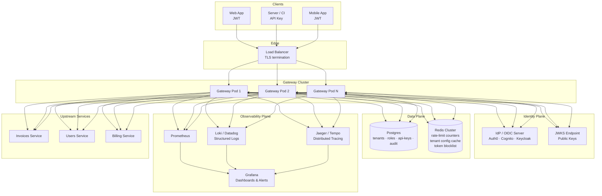
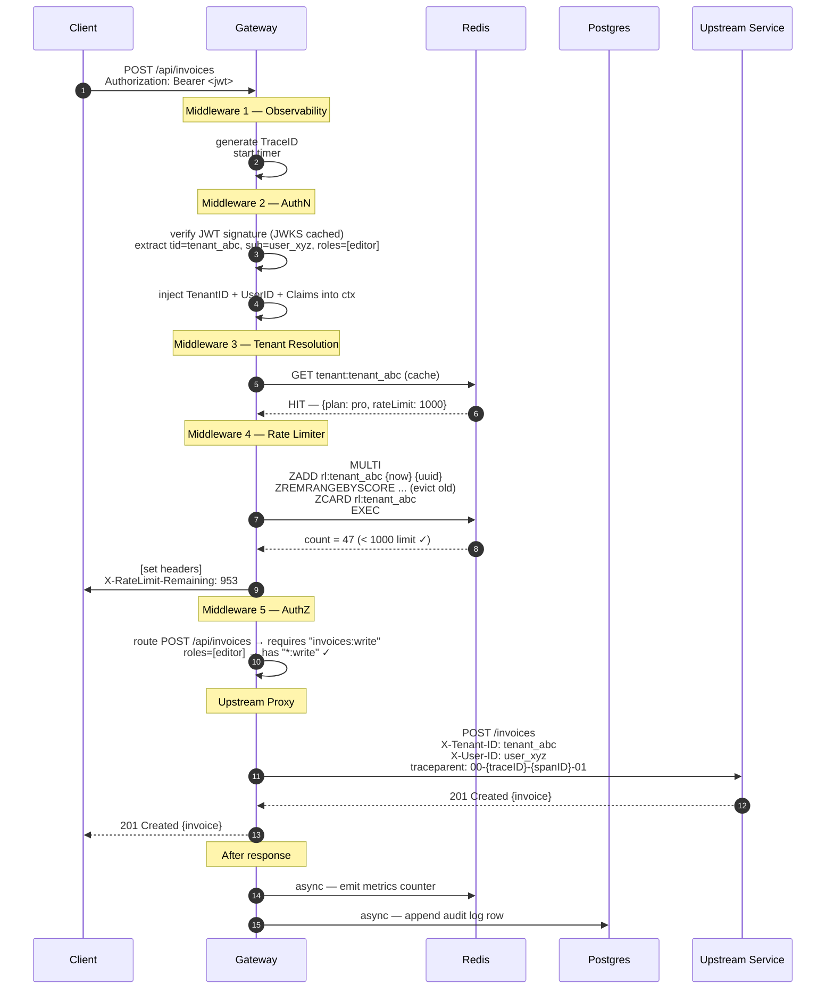
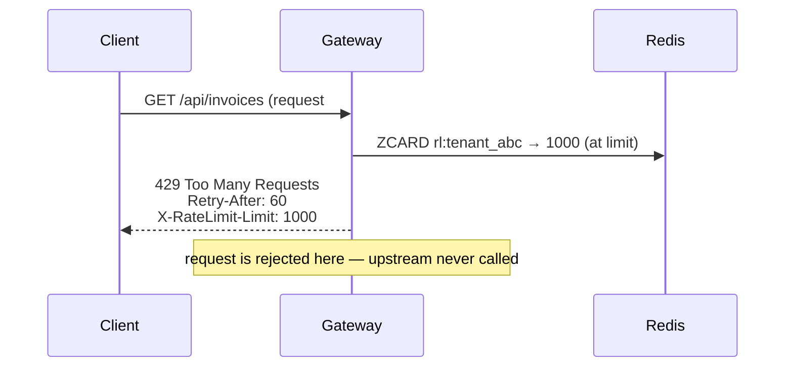
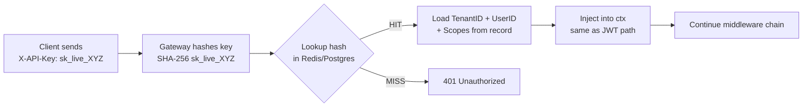
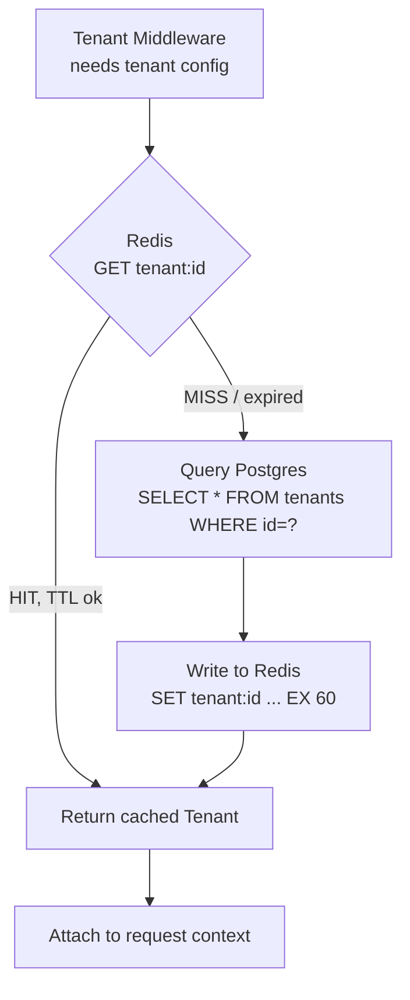
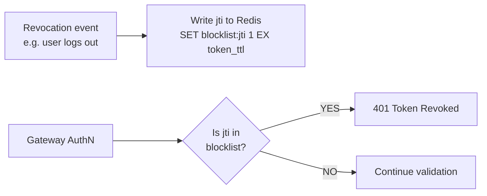
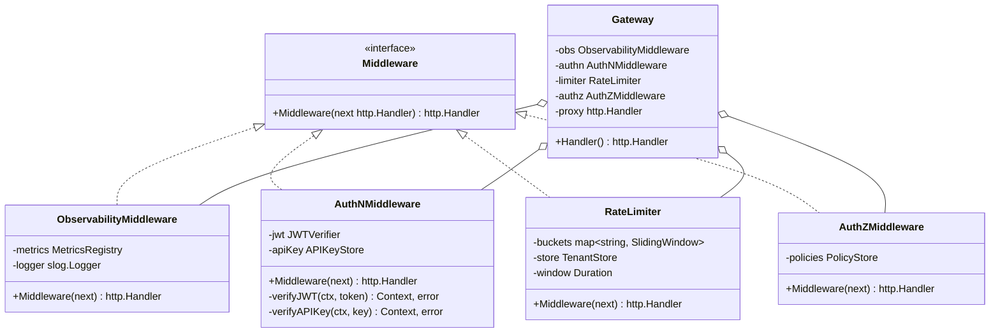
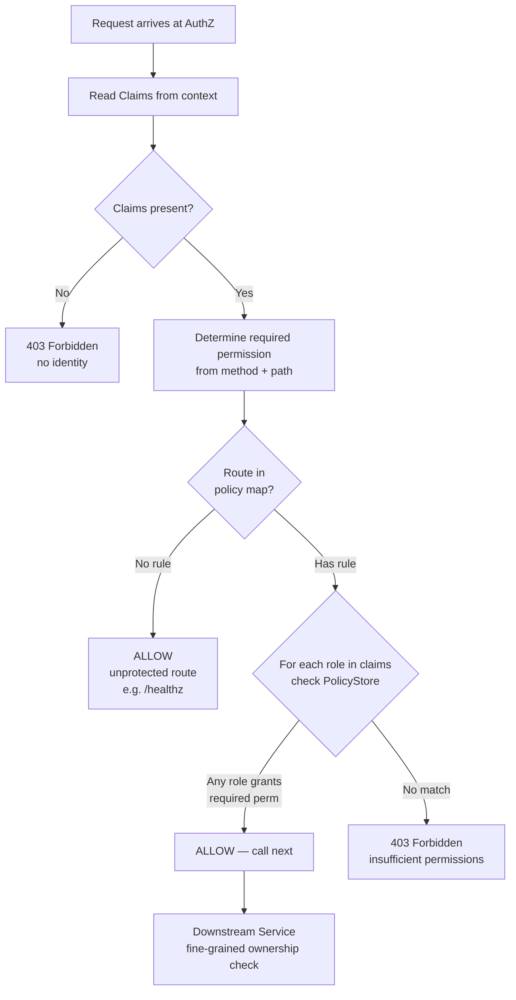
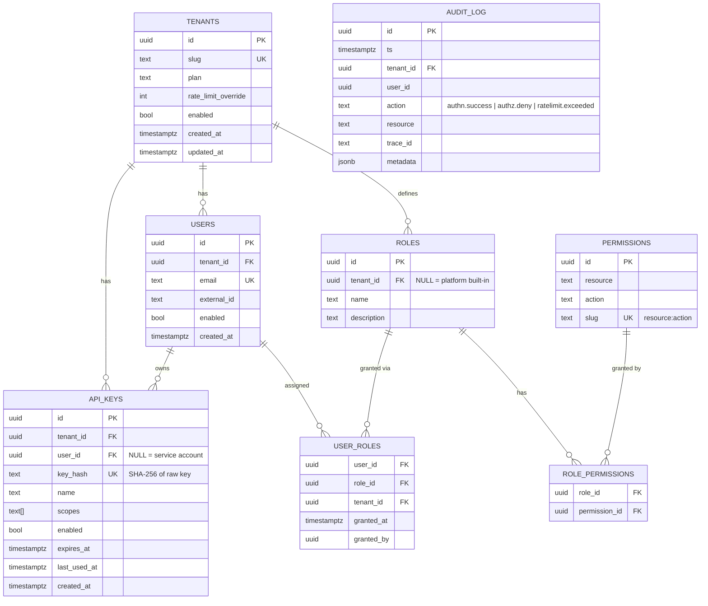

# Multi-Tenant SaaS API Gateway — System Design

---

## Table of Contents
1. [High-Level Design (HLD)](#1-high-level-design)
2. [Data Flow Diagrams](#2-data-flow-diagrams)
3. [Low-Level Design (LLD)](#3-low-level-design)
4. [Schema Design](#4-schema-design)
5. [Database Selection & CAP Theorem](#5-database-selection--cap-theorem)
6. [Non-Functional Requirements & Trade-offs](#6-non-functional-requirements--trade-offs)

---

## 1. High-Level Design

### 1.1 Context & Goals

| Requirement | Decision |
|---|---|
| Multiple isolated tenants on shared infra | Tenant-scoped everything: rate limits, roles, metrics |
| Sub-10ms gateway overhead (p99) | In-process middleware chain, Redis for shared state |
| Horizontal scale | Stateless gateway pods; all shared state in Redis/Postgres |
| Credential flexibility | JWT (user sessions) + API keys (server-to-server) |
| Auditability | Append-only audit log for every auth/authz decision |
| Fine-grained observability | Per-tenant RED metrics + distributed traces |

---

### 1.2 System Components



---

### 1.3 Why Stateless Gateway Pods?

```
Without stateless design:
  Request 1 → Pod A  (rate limit counter = 1)
  Request 2 → Pod B  (rate limit counter = 1)  ← pod B doesn't know about pod A
  → Tenant sees 2× their quota

With shared Redis counters:
  Request 1 → Pod A  → ZADD redis   (counter = 1)
  Request 2 → Pod B  → ZADD redis   (counter = 2)
  → Consistent, correct limiting across all pods
```

Statefulness lives in **Redis** (ephemeral, fast) and **Postgres** (durable, authoritative). Gateway pods carry zero per-request state.

---

## 2. Data Flow Diagrams

### 2.1 Happy Path — JWT Request



---

### 2.2 Rate Limit Exceeded



---

### 2.3 API Key Authentication Flow



---

### 2.4 Tenant Cache-Aside Pattern



**TTL choice (60s):** Plan upgrades take effect within 60s without a deploy. A tenant downgrade (e.g. payment failure → disable) can be forced by DEL on the cache key from a webhook handler.

---

### 2.5 Token Revocation (Blocklist)

JWTs are stateless — you cannot "un-issue" them. For immediate revocation (user logout, key compromise):



Only the `jti` (JWT ID claim) is stored — not the full token. The key expires automatically when the token would have expired anyway, keeping the blocklist bounded.

---

## 3. Low-Level Design

### 3.1 Middleware Chain Contract

```
Every middleware MUST:
  1. Be independently testable (no global state, deps via closure).
  2. Either call next.ServeHTTP() or write a response — never both.
  3. Never mutate the original http.Request — use r.WithContext(newCtx).
  4. Use structured logging with trace_id from context.

Execution order (outermost → innermost):
  Observability → AuthN → TenantResolution → RateLimit → AuthZ → Proxy
```



---

### 3.2 Rate Limiter — Algorithm Comparison

```
Algorithm       Memory    Burst behaviour      Boundary safety    Complexity
─────────────────────────────────────────────────────────────────────────────
Fixed Window    O(1)      2× at boundary       ✗ burst possible   Low
Token Bucket    O(1)      Configurable burst   ✓ smooth           Medium
Sliding Log     O(n)      No burst             ✓ exact            Medium
Sliding Window  O(n)      ~smoothed            ✓ near-exact       Medium
─────────────────────────────────────────────────────────────────────────────
Chosen: Sliding Log (ZSET in Redis)
  - Exact — no boundary burst
  - Atomic multi-command via MULTI/EXEC
  - Redis ZSET eviction is O(log n)
  - n is bounded by the rate limit (e.g. 1000 entries max)
```

Redis commands (atomic via MULTI/EXEC):
```
ZADD   rl:{tenantID} {now_ms}             {uuid}
ZREMRANGEBYSCORE rl:{tenantID} 0          {now_ms - 60000}
ZCARD  rl:{tenantID}
EXPIRE rl:{tenantID} 61
```

---

### 3.3 JWT Verification — Security-Critical Steps

```
Step  Check                      Vulnerability if skipped
────  ─────────────────────────  ─────────────────────────────────────────────
1     Signature valid?           Attacker forges arbitrary tokens
2     alg ≠ "none"?              alg=none attack: any unsigned token accepted
3     kid → correct public key   Key confusion: wrong key accepts attacker token
4     exp not passed?            Replay attack with expired credential
5     iss matches trusted IdP?   Token from rogue issuer accepted
6     aud matches this service?  Token issued for another service accepted
7     jti not in blocklist?      Revoked/logged-out token still valid
```

---

### 3.4 AuthZ — Decision Flow



**Two-tier enforcement:**
- **Gateway**: "Can role `editor` touch `/api/invoices` at all?" — cheap, no DB
- **Service**: "Can user X read *this specific* invoice owned by org Y?" — requires business context

---

## 4. Schema Design

### 4.1 Entity Relationship



---

### 4.2 Table Definitions (Postgres DDL)

```sql
-- Tenants are the top-level isolation boundary.
CREATE TABLE tenants (
    id                   UUID PRIMARY KEY DEFAULT gen_random_uuid(),
    slug                 TEXT UNIQUE NOT NULL,        -- "acme-corp"
    plan                 TEXT NOT NULL DEFAULT 'free' -- free | pro | enterprise
                         CHECK (plan IN ('free', 'pro', 'enterprise')),
    rate_limit_override  INT,                         -- NULL = use plan default
    enabled              BOOL NOT NULL DEFAULT true,
    metadata             JSONB,                       -- custom config, feature flags
    created_at           TIMESTAMPTZ NOT NULL DEFAULT now(),
    updated_at           TIMESTAMPTZ NOT NULL DEFAULT now()
);

-- Users belong to exactly one tenant.
CREATE TABLE users (
    id           UUID PRIMARY KEY DEFAULT gen_random_uuid(),
    tenant_id    UUID NOT NULL REFERENCES tenants(id) ON DELETE CASCADE,
    email        TEXT NOT NULL,
    external_id  TEXT,            -- IdP subject (OIDC sub claim)
    enabled      BOOL NOT NULL DEFAULT true,
    created_at   TIMESTAMPTZ NOT NULL DEFAULT now(),
    UNIQUE (tenant_id, email)     -- email unique within a tenant, not globally
);

-- Roles are tenant-scoped; NULL tenant_id = platform built-in.
CREATE TABLE roles (
    id          UUID PRIMARY KEY DEFAULT gen_random_uuid(),
    tenant_id   UUID REFERENCES tenants(id) ON DELETE CASCADE,
    name        TEXT NOT NULL,
    description TEXT,
    UNIQUE (tenant_id, name)
);

-- Permissions are platform-wide constants.
CREATE TABLE permissions (
    id       UUID PRIMARY KEY DEFAULT gen_random_uuid(),
    resource TEXT NOT NULL,   -- "invoices" | "*"
    action   TEXT NOT NULL,   -- "read" | "write" | "*"
    slug     TEXT UNIQUE NOT NULL GENERATED ALWAYS AS (resource || ':' || action) STORED
);

-- Many-to-many: roles → permissions.
CREATE TABLE role_permissions (
    role_id       UUID NOT NULL REFERENCES roles(id) ON DELETE CASCADE,
    permission_id UUID NOT NULL REFERENCES permissions(id) ON DELETE CASCADE,
    PRIMARY KEY (role_id, permission_id)
);

-- Many-to-many: users → roles (within a tenant).
CREATE TABLE user_roles (
    user_id    UUID NOT NULL REFERENCES users(id) ON DELETE CASCADE,
    role_id    UUID NOT NULL REFERENCES roles(id) ON DELETE CASCADE,
    tenant_id  UUID NOT NULL REFERENCES tenants(id) ON DELETE CASCADE,
    granted_at TIMESTAMPTZ NOT NULL DEFAULT now(),
    granted_by UUID REFERENCES users(id),
    PRIMARY KEY (user_id, role_id)
);

-- API keys — only the SHA-256 hash is stored; the raw key is never persisted.
CREATE TABLE api_keys (
    id           UUID PRIMARY KEY DEFAULT gen_random_uuid(),
    tenant_id    UUID NOT NULL REFERENCES tenants(id) ON DELETE CASCADE,
    user_id      UUID REFERENCES users(id) ON DELETE SET NULL,
    key_hash     TEXT UNIQUE NOT NULL,  -- hex(SHA-256(raw_key))
    name         TEXT NOT NULL,         -- "CI deploy key" — human label
    scopes       TEXT[] NOT NULL DEFAULT '{}',
    enabled      BOOL NOT NULL DEFAULT true,
    expires_at   TIMESTAMPTZ,
    last_used_at TIMESTAMPTZ,
    created_at   TIMESTAMPTZ NOT NULL DEFAULT now()
);

-- Append-only audit log. NEVER UPDATE OR DELETE rows.
-- Partition by month in production (pg_partman).
CREATE TABLE audit_log (
    id        UUID NOT NULL DEFAULT gen_random_uuid(),
    ts        TIMESTAMPTZ NOT NULL DEFAULT now(),
    tenant_id UUID NOT NULL,             -- no FK — log must survive tenant delete
    user_id   UUID,
    action    TEXT NOT NULL,             -- "authn.success" | "authz.deny" etc.
    resource  TEXT,
    trace_id  TEXT,
    metadata  JSONB,
    PRIMARY KEY (ts, id)                 -- ts first for range partitioning
) PARTITION BY RANGE (ts);

-- Indexes
CREATE INDEX ON users         (tenant_id, email);
CREATE INDEX ON api_keys      (tenant_id, enabled);
CREATE INDEX ON user_roles    (user_id,   tenant_id);
CREATE INDEX ON audit_log     (tenant_id, ts DESC);
CREATE INDEX ON audit_log     (trace_id) WHERE trace_id IS NOT NULL;
```

---

### 4.3 Redis Key Schema

```
Key pattern                         Type    TTL       Purpose
──────────────────────────────────  ──────  ────────  ──────────────────────────
tenant:{id}                         Hash    60s       Cached tenant config row
rl:{tenantID}                       ZSet    61s       Sliding-window timestamps
blocklist:{jti}                     String  token_ttl Revoked JWT IDs
apikey:{hash}                       Hash    300s      Cached API key → identity
session:{sessionID}                 Hash    30min     If using server sessions
lock:tenant:{id}:upgrade            String  10s       Distributed lock for writes
```

Naming conventions:
- `:` as namespace separator (industry standard)
- No spaces or special chars in keys
- TTLs always set — no immortal keys that leak memory

---

## 5. Database Selection & CAP Theorem

### 5.1 CAP Theorem Recap

Under a **network partition** a distributed system must choose:

```
C — Consistency:   every read sees the most recent write (or an error)
A — Availability:  every request gets a response (never an error)
P — Partition tol: system works despite network splits
```

P is non-negotiable in a distributed system — networks do partition. So the real choice is **CP vs AP** during a partition.

---

### 5.2 Database Decisions by Component

```mermaid
quadrantChart
    title CAP Positioning of Databases Used
    x-axis Availability --> Consistency
    y-axis Low Latency --> High Durability
    quadrant-1 High Consistency, High Durability
    quadrant-2 Low Latency, High Durability
    quadrant-3 Low Latency, Low Durability
    quadrant-4 High Consistency, Low Durability
    Postgres (primary): [0.85, 0.90]
    Redis (cache): [0.30, 0.25]
    Redis (rate limiter): [0.40, 0.30]
    Kafka (audit): [0.70, 0.85]
```

| Component | Store | CAP Choice | Why |
|---|---|---|---|
| Tenant config | **Postgres** (primary-replica) | **CP** | Correctness required — wrong plan = wrong rate limit. Accept unavailability on partition; serve stale from cache. |
| Rate limit counters | **Redis Cluster** | **AP** | Slightly over/under limit is acceptable. Availability > hard consistency. |
| API keys | **Postgres** + Redis cache | **CP** | A revoked key must not authenticate. Cache is read-only with short TTL. |
| JWT blocklist | **Redis** | **AP** | If Redis is partitioned, worst case: a revoked token works for the TTL window. Acceptable for most SaaS. |
| Audit log | **Postgres** (partitioned) + optionally **Kafka** | **CP** | Audit records must not be lost. Kafka as buffer absorbs traffic spikes. |
| Roles & permissions | **Postgres** | **CP** | Authorization decisions must reflect current policy. |
| Distributed rate-limit lock | **Redis** (Redlock) | **AP** | Best-effort; no strong guarantees needed. |

---

### 5.3 Consistency Trade-offs Explained

**Rate limiter (AP — eventual consistency accepted)**

```
Scenario: Redis primary partitioned from replica for 500ms.
Effect:   Two gateway pods read from two different Redis nodes.
          Tenant may get ~2× their quota for 500ms.
Impact:   Minor — quota overage is bounded and self-correcting.
Decision: AP is correct here. A 429 rejection latency spike is worse.
```

**Tenant config (CP — consistency required)**

```
Scenario: Redis cache is stale (60s TTL not yet expired).
          Tenant was just disabled (payment failure).
Effect:   Tenant can make requests for up to 60s after disabling.
Mitigation: On tenant.disable event → DEL cache key immediately (write-through).
            Keep TTL as a safety net, not the primary mechanism.
Decision: Cache invalidation on write; TTL is belt-and-suspenders.
```

**API key (CP — strict)**

```
Scenario: Admin revokes an API key (security incident).
Effect:   Must take effect immediately — not 60s later.
Decision: On revocation:
            1. DELETE from Postgres.
            2. DEL from Redis cache.
            3. SET blocklist:{hash} 1 EX 3600.  ← belt-and-suspenders
          Step 3 ensures even if cache is re-populated from a stale read
          replica, the blocklist check still rejects the key.
```

---

### 5.4 Postgres Topology

```
                    ┌─────────────────┐
                    │  Primary (RW)   │
                    │  Postgres       │
                    └────────┬────────┘
                             │ streaming replication (sync for audit_log)
               ┌─────────────┴────────────┐
               ▼                          ▼
    ┌──────────────────┐       ┌──────────────────┐
    │  Replica 1 (RO)  │       │  Replica 2 (RO)  │
    │  reads + reports │       │  reads + failover │
    └──────────────────┘       └──────────────────┘
```

- **Writes** (tenant upsert, audit log, role changes) → Primary only
- **Reads** (tenant lookup, permission check) → Any replica (acceptable lag ~10ms)
- **Audit log** uses **synchronous replication** to at least one replica — we cannot lose audit rows

---

### 5.5 Redis Topology

```
Redis Cluster (hash slots 0-16383 split across 3 primaries):

  Shard 1 (slots 0-5460)         Shard 2 (slots 5461-10922)      Shard 3 (slots 10923-16383)
  ├─ Primary                     ├─ Primary                       ├─ Primary
  └─ Replica                     └─ Replica                       └─ Replica

Rate limit key rl:{tenantID} hashes to one shard deterministically.
All atomic MULTI/EXEC commands for a tenant hit the same shard → no cross-shard coordination needed.
```

---

## 6. Non-Functional Requirements & Trade-offs

### 6.1 Latency Budget (p99 target: < 10ms gateway overhead)

```
Operation                      Typical Latency   Budget
─────────────────────────────  ────────────────  ──────
JWT signature verify (HMAC)    ~0.1ms            0.2ms
Redis tenant cache GET         ~0.5ms            1ms
Redis rate limit MULTI/EXEC    ~0.8ms            2ms
Postgres permission check      ~2ms              —  (avoided by caching)
Observability (async emit)     ~0ms (goroutine)  0ms
Logging (async buffer)         ~0ms (goroutine)  0ms
─────────────────────────────  ────────────────  ──────
Total (cache hits)             ~1.5ms            < 5ms
Total (cache miss + Postgres)  ~5ms              < 10ms
```

Permissions and tenant config are **never looked up synchronously from Postgres** on the hot path — always read from Redis. Postgres is the source of truth on write; Redis is the read cache.

---

### 6.2 Scalability

```
Dimension          Approach
─────────────────  ──────────────────────────────────────────────────────────
Traffic            Horizontal pod scaling (Kubernetes HPA on CPU + req/s)
Tenants            Sharding is not required — all per-tenant data keyed by UUID
Rate limit scale   Redis Cluster; each tenant's counter is isolated to one shard
Audit log scale    Postgres RANGE partitioning by month; archive to S3 after 90d
Observability      Prometheus federation + remote_write to Thanos/Cortex at scale
```

---

### 6.3 Security Checklist

```
✓  TLS enforced at load balancer; no HTTP internally for auth flows
✓  JWT: RS256 (asymmetric) in production; HMAC only in demos
✓  JWT: verify exp, iss, aud, kid, jti-blocklist
✓  API keys: only SHA-256 hash stored; raw key never logged or persisted
✓  Tenant isolation: every query scoped by tenant_id; no cross-tenant reads
✓  Rate limits prevent DDoS and cost attacks per tenant
✓  Audit log is append-only; DDL revokes UPDATE/DELETE from app role
✓  Context keys are unexported types; no accidental key collisions
✓  X-Forwarded-For only trusted from known LB CIDR; spoofing mitigated
✓  Permission checks at two levels: gateway (coarse) + service (fine-grained)
```

---

### 6.4 Failure Modes

| Failure | Gateway Behaviour | Recovery |
|---|---|---|
| Redis down | Fall through to Postgres for tenant config; rate limiting disabled (fail open) | Redis sentinel / cluster auto-failover < 30s |
| Postgres down | Serve from Redis cache; reject any write-path ops | PG primary failover via Patroni/pg_auto_failover |
| IdP JWKS endpoint unreachable | Serve from cached JWKS; if expired and still unreachable → reject new tokens | JWKS cached with long TTL (6h); alerts on cache age |
| Upstream service down | Return 502 with trace ID; do not retry by default (idempotency unknown) | Circuit breaker (half-open after 10s) |
| Pod crash mid-request | Client sees TCP reset; upstream may or may not have processed | Idempotency keys on unsafe methods |
